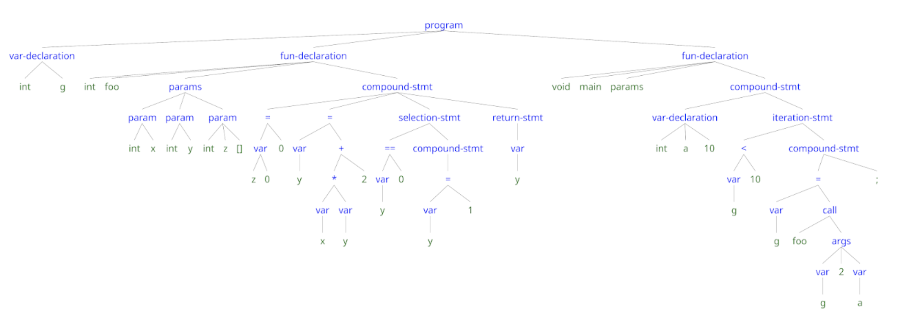

# Projeto de um Compilador

## Trabalho 2 (T2): Análise Sintática

Analisador sintático bottom-up para C-

Nesta parte do projeto, você irá implementar um analisador sintático _bottom-up_ para a [linguagem C-](./cminus/cminus-02.md) com
construção da árvore sintática abstrata (AST - Abstract Syntax Tree) para 
programas C- corretos.
O trabalho prático T2 inclui a implementação de um analisador sintático, construído com a ferramenta _Bison_, 
funções auxiliares para a construção da AST durante o processo de análise, 
uma função de _prettyprint_ para gerar uma representação externa para AST 
e o programa principal (detalhes a seguir).


O analisador sintático gerado pelo Bison, _yyparse()_, deve receber uma sequência de _tokens_ 
enviados pelo analisador léxico _yylex()_, e determinar se um programa C- segue ou não a especificação definida por sua gramática.
Em caso de sucesso, 
o analisador sintático deve gerar uma AST para o programa de entrada analisado 
e disponibilizar uma referência para a raiz da AST construída, para ser usada pela função _prettyprint_.
Em caso de erro sintático detectado, 
apenas uma mensagem de erro deverá ser reportada e a análise sintática deve ser interrompida.

O código de funções auxiliares para a criação e manipulação da AST e
para a geração de uma representação usando a notação de 
_labelled bracketing_ para a AST retornada 
(explicada mais adiante) também faz parte do T2
e é fornecido pela professora.

Antes de iniciar a implementação do T2 em equipe, 
recomendamos a leitura dos capítulos 5 e 6 do livro 
"Introduction to Compilers and Language Design" de Douglas Thain.
Apesar da sintaxe de C- ser um pouco diferente da usada no livro de Thain, 
os exemplos de código e o material são úteis.
Recomendamos fortemente que os exercícios E5, E6 e E7 sejam resolvidos antes de começar a trabalhar no trabalho T2.

Uma consulta interessante é uma [especificação yacc para ANSI C](https://www.lysator.liu.se/c/ANSI-C-grammar-y.html)
feita no século passado (década de 80).

O analisador sintático para C- deverá ser desenvolvido com Bison, 
com base na [especificação sintática de C-](./cminus/cminus-02.md)
e integrado com uma versão alterada (com #include "token.h"
e remoção da função main() do  analisador léxico para C- 
desenvolvido com Flex no T1 (conforme explicado em sala de aula).

### Notação para a Árvore Sintática Abstrata (Abstract Syntax Tree - AST)

Há diversas formas para representar árvores sintáticas corretas geradas para um programa C-.
Em nosso projeto de compilador, é importante definir e usar um formato único para representar
a AST, que seja independente de qualquer linguagem específica, seja fonte ou objeto.

Em nosso compilador, 
o analisador sintático construirá uma AST para programas C- sem erros léxicos e sem sintáticos.
O trabalho T2 deve incluir uma função _main_ para chamar a função _yyparse()_ gerada pelo Bison. 
Para mostrar a AST criada, 
a função _main_ deve chamar a função _prettyprint_, tendo como argumento a raiz da AST,
para percorrer e gerar uma representação da AST
na notação de _labelled bracketing_.

A notação de _labelled bracketing_
define listas aninhadas de _prefix expressions_ (operadores antes dos operandos), 
usando colchetes para organizá-las.
Por exemplo, a expressão ``` 2 * 7 + 3``` mostrada acima,
é representada como ```[+ [* [2] [7]] [3]]``` na notação de _labelled bracketing_.
Cada número inteiro NUM, é representado como ```[NUM]```, por exemplo, ```[2] e [7]```,
e a operação de multiplicação entre dois números, como ```[* [2] [7]]```.

__Formato Geral__:
```
[operator [operand1] ... [operandN]]
```

Recursivamente, cada operando pode contem outra operação, por exemplo,
```
[op1 [op2 [a] [b]] [c]]
```
onde o operador ```op1``` possui os operandos ```[op2 [a] [b]]``` e ```[c]```,
e o operador ```op2``` tem como operandos ```[a]``` e ```[b]```.

Assim, a AST para a expressão ``` 2 * 7 + 3```
deve ser representada como ```[+ [* [2] [7]] [3]]``` na notação de _labelled bracketing_.


### Listas de nós que podem ser mostrados na AST (ainda v1.0) / v2.0 em andamento.

Tipos de nós que podem aparecem em uma AST e seus nomes correspondentes,
que deverão ser produzidos pelo seu analisador sintático:

```[program  ... ]```

* ```[var-declaration  ... ]```

   * [int]                ---> nome do tipo

   * [ID]                 ---> nome de variável

   * ```[\[\]]```         ---> (opcional) símbolo para descrever uma váriavel como array; 

IMPORTANTE: o símbolo de barra invertida (backslash \) é usado para não interpretar [ ou ] como nós de colchetes, e sim para serem símbolos visíveis na AST.

* ```[fun-declaration  ... ]```

   * [int] / [void]       ---> o tipo int ou uso de void

   * [ID]                 ---> nome de função

   * [params  ...  ]      ---> gerar apenas [params], se não houver parâmetros na função

      * [param  ... ]     ---> (opcional) informação sobre parâmetro

         * [int]           ---> o tipo int

         * [ID]                 ---> nome de variável

   * ```[compound-stmt  ... ]```     ---> (opções de filhos abaixo)

   - [;]                             ---> comando vazio

   - ```[selection-stmt ... ]```     ---> ou comando IF

      * ver EXPRESSION             ---> definição recursiva de qualquer expressão válida

      * [compound-stmt  ...]       --> ramo "then" (true)

      * [compound-stmt  ... ]      --> (opcional) ramo "else" (false)

   - ```[iteration-stmt  ... ]```  --> apenas "while"

      * ver EXPRESSION              --> definição recursiva de qualquer expressão válida

      * [compound-stmt ... ]        --> bloco de comandos do while (statements)

   - ```[return-stmt ... ]```

      * ver EXPRESSION             --> definição recursiva de qualquer expressão válida

   - ```[OP ... ]```              --> operadores de expressão binária
     ```OP pode ser: +, -, *, /, <, <=, >, >=, ==, !=, =```

      * [var  ... ]      ---> uso de variável

         * [ID]

         * [NUM]     --> (opcional) índice de array

      * [NUM]             ---> uso de valor (literal) do tipo integer

      * [call  ... ]      ---> chamada (call) de função

         * [ID]

         * [args ... ]         ---> argumentos de função

      * [OP ... ]        ---> expressão binária ou unária

## Bison e Flex

O Bison deverá ser utilizado para geração do analisador sintático,
trabalhando em conjunto com o analisador léxico 
gerado pelo Flex (T1).

```$ bison --defines=token.h cminus.y```

A opção --defines faz com que o Bison gere o arquivo _token.h_, 
que faz a interface com o analisador léxico gerado pelo Flex.

   - O arquivo _lexer.l, criado no T1, deverá ser renomeado para _cminus.l_.
   - O arquivo _cminus.l_ deverá ser modificado para incluir o arquivo "token.h", gerado pelo Bison.
   - Todo o código usado para definir tokens, por exemplo, 
listas ou tipos escalares, usado no T1 deve ser eliminado.
Os tokens serão definidos no arquivo _cminus.y_, usando a diretiva ```%token```.
Também deve ser removida a função _main_ usada no T1.
Obs.: Na pasta _src_ está um template cminus.l, caso queiram usar.

Em seguida, rodar o Flex (observar o novo nome):

```$ flex cminus.l```

Por fim, 
compilar e gerar o executável chamado de _cminus_. 
As funções para criação e manipulação da AST estão nos arquivos _ast.c_ e _ast.h_.
A função _main_ chama a função _bracket_
para geração de saída no formato _labelled bracket_.
A função _main_ está definida em um arquivo C chamado de _main.c_.

O arquivo _makefile_ contém instruções para compilar os arquivos 
e gerar o executável _cminus_. Para limpar os arquivos temporários,
use o comando ```make clean```.

### Como executar o analisador sintático

No T2, também usaremos nomes de arquivos passados como argumentos 
na chamada a _cminus_.
A função _main_  chama a função _yyparse()_ que, em caso de sucesso,
coloca o endereço da raiz da AST na variável _parser_result_, 
e chama a função _bracket_  para gerar a representação da AST na notação _labelled bracket_.
Em caso de erro sintático identificado, 
o mesmo será reportado e a análise interrompida, sem geração de AST.

```$ ./cminus nome.cm nome.out```, 
sendo que o arquivo _nome.cm_ contém o programa-fonte em C- 
e _exemplo.out_ contém a AST para o programa-fonte 
representada na notação _labelled bracket_.

**Observação**:  Atenção para os nomes usados no T2.
- O nome do arquivo Flex modificado deve ser cminus.l
- O nome do arquivo Bison deve ser cminus.y
- Manter os nomes ast.h e ast.c para definição e manipulação da AST
- O nome do arquivo que contém a função _main_ deve ser main.c.

## Exemplo 1 
### Arquivo de entrada em C- exemplo.cm
(exemplo.cm contém um programa sintaticamente correto.)

```
int g;

int foo(int x, int y, int z[]) {

    z[0] = 0;
    y = x * y + 2;

    if(y == 0){
        y = 1;
    }

    return y;

}

void main(void) {

    int a[10];

    while (g < 10) do {
        g = foo(g, 2, a);
        ;
    }
}
```

### Saída após análise sintática do programa C- _exemplo.cm_

Importante: Caracteres de espacejamento serão ignorados na correção automática.

```
[program
  [var_declaration [int] [g]]
  [fun-declaration
    [int]
    [foo]
    [params
      [param [int] [x]]
      [param [int] [y]]
      [param [int] [z] [\[\]]]
    ]
    [compound-stmt
      [= [var [z] [0]] [0]]
      [= [var [y]]
        [+
          [* [var [x]] [var [y]]] [2]]]
      [selection-stmt
        [== [var [y]] [0]]
        [compound-stmt
          [= [var [y]] [1]]
        ]
      ]
      [return-stmt [var [y]]]
    ]
  ]

  [fun-declaration
    [void]
    [main]
    [params]
    [compound-stmt
      [var-declaration [int] [a] [10]]
      [iteration-stmt
        [< [var [g]] [10]]
        [compound-stmt
          [= [var [g]]
            [call
              [foo]
              [args [var [g]] [2] [var [a]]]
            ]]
          [;]
        ]
      ]
    ]
  ]


]
```
### Ilustração de AST gerada com a ferramenta 
[RSyntaxTree](https://yohasebe.com/rsyntaxtree/)



## Outro Exemplo
### Entrada em C-

```
int min;
int color;
void main(void) {
   min = 0;
   color = 0; // red
}
```

### Saída

```
[program
  [var-declaration [int][min]]
  [var-declaration [int][color]]
  [fun-declaration
    [void]
    [main]
    [params]
    [compound-stmt
       [= [var [min]] [0]]
       [= [var [color]] [0]]
     ]
   ]
]
```

## Correção Automática

A correção automática do trabalho T2 será feita com o apoio de _scripts_.
Desse modo, a correção irá considerar apenas os arquivos colocados 
no repositório GitHub da equipe,
com os nomes de arquivos indicados na especificação do trabalho.

--------
Parte deste material foi cedido pelo Prof. Vinicius Petrucci 
e traduzido por Christina von Flach.
<!-- https://ruslanspivak.com/lsbasi-part1/ -->
